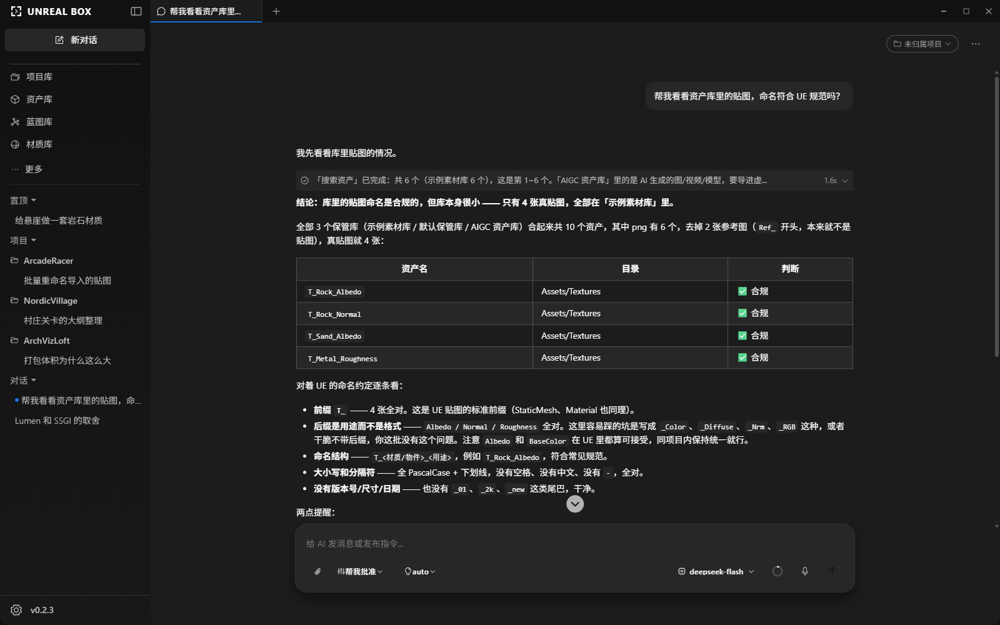
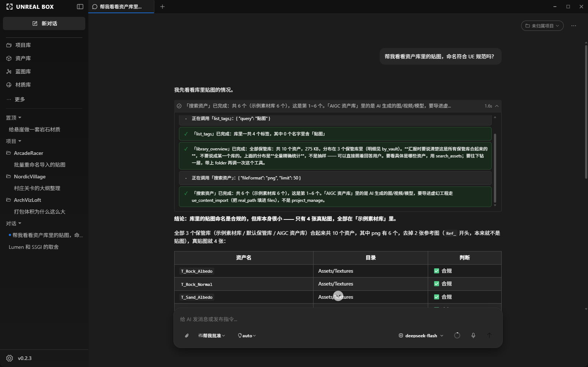
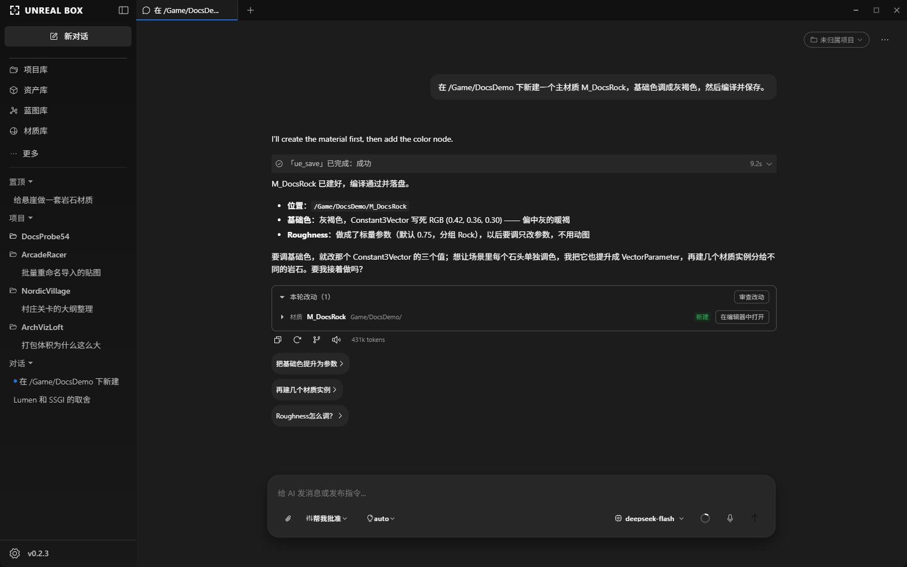
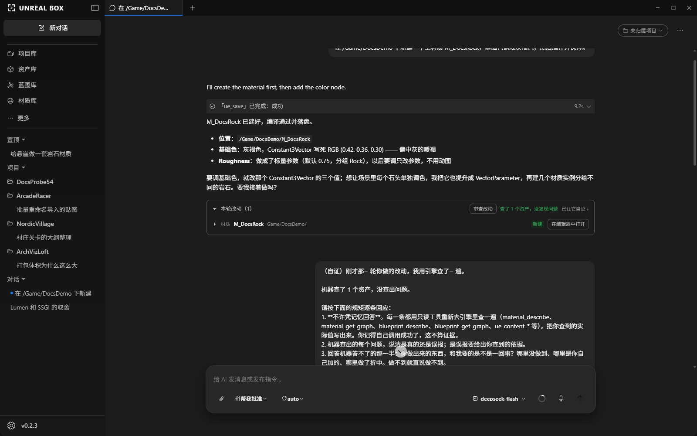
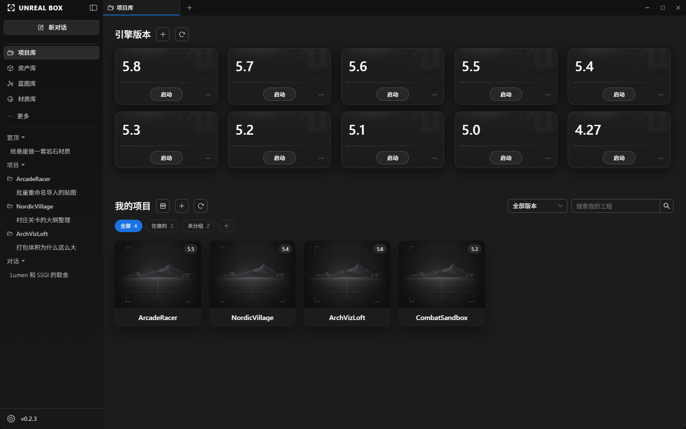
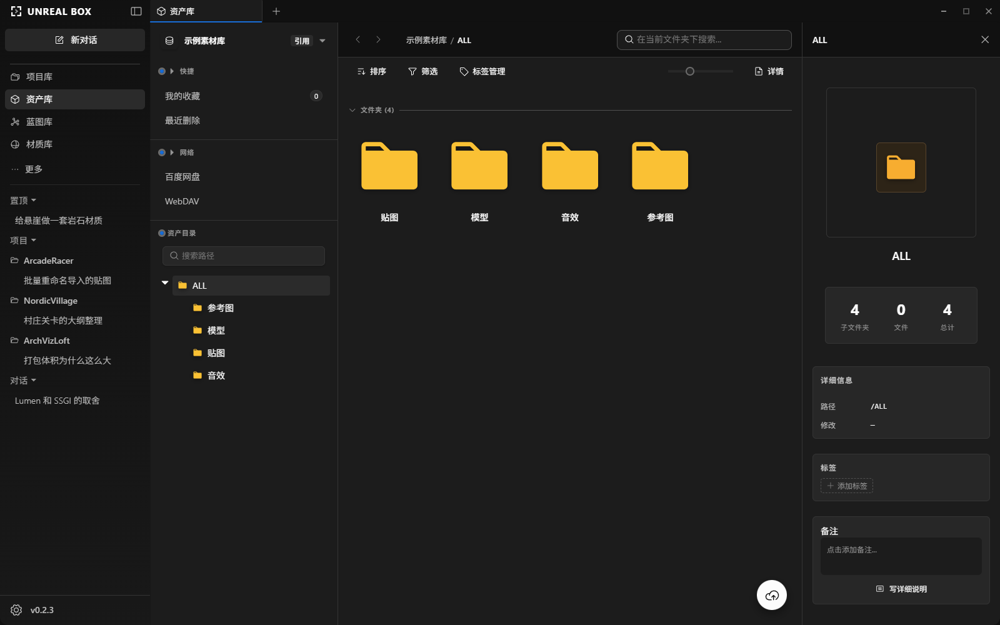
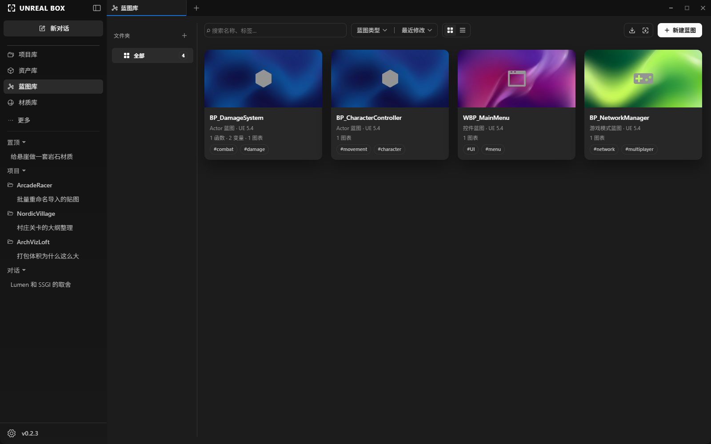
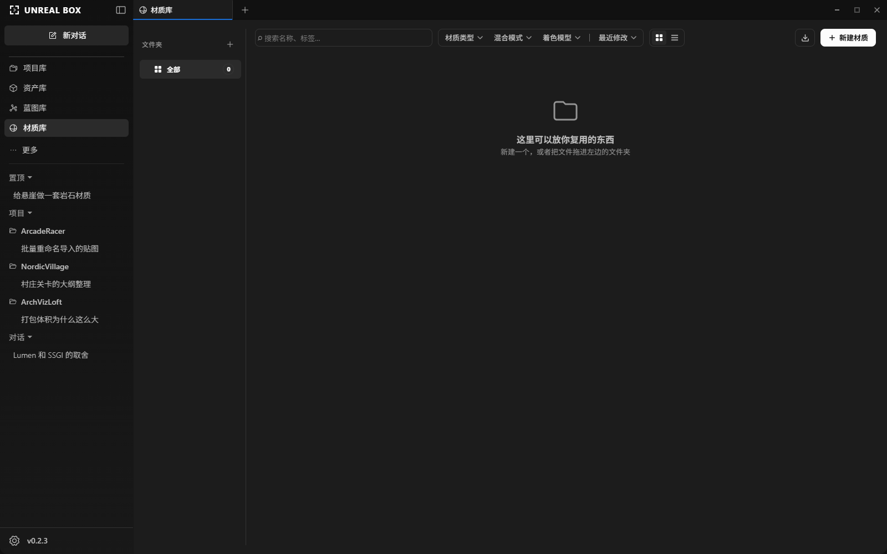
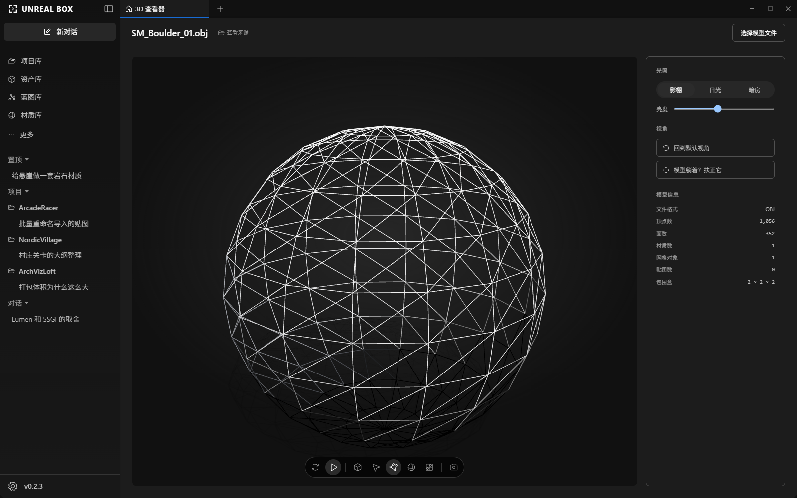
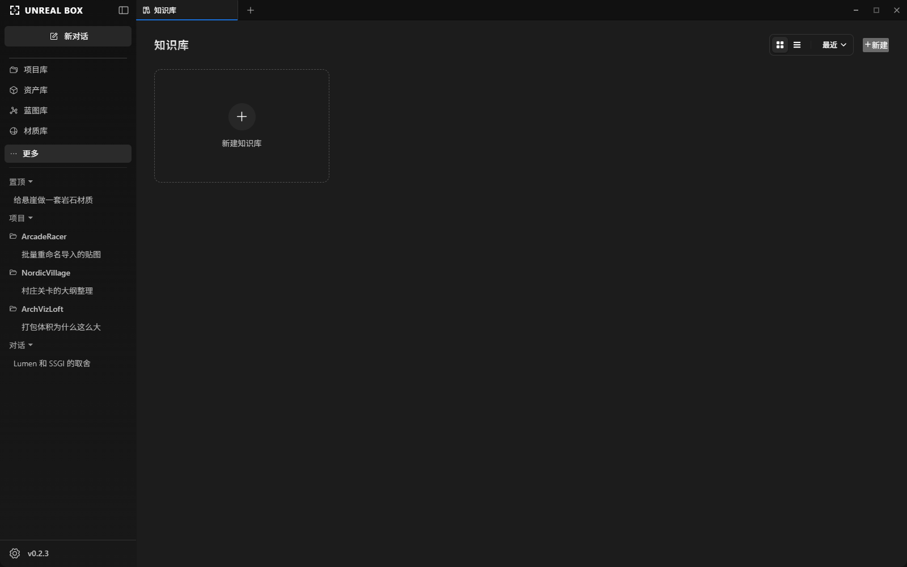

<p align="center">
  
</p>

<h1 align="center">虚幻盒子 · UE Box</h1>

<p align="center">
  <b>直接操作虚幻编辑器的开源 AI Agent</b><br>
  给一个目标，让 AI 在你正在跑的项目里把活干完 —— 放 Actor、改蓝图、连材质、编译 C++。<br>
  每一步可审批，每处改动可核对。
</p>

<p align="center">
  <a href="LICENSE"></a>
  
  
  
</p>

<p align="center">
  <a href="https://uebox.ai">官网</a> ·
  <a href="https://github.com/ueboxai/uebox/releases">下载</a> ·
  <a href="https://uebox.ai/guide/">使用手册</a> ·
  <a href="CHANGELOG.md">更新日志</a> ·
  <a href="README.en.md">English</a>
</p>

<!-- TODO: GIF 录好后替换下面这张静态图（给目标 → Agent 摆 Actor → 引擎里真的变了，10 秒以内），放在 website/public/shots/ 下 -->



---

## 它是什么

一个桌面应用。你配一家模型服务商，它通过 UnrealAgentLink 插件连上正在运行的虚幻编辑器，
用一百多个引擎工具和 25 个内置技能替你干活。常规操作直接执行，风险操作停下来等你确认。
它说做完了不算数 —— 改完回引擎核实一遍，再让它自己举证。

产品的主体是这个 Agent。项目库、资产库、蓝图库与材质库、笔记与知识库各自有完整的独立界面，
也可以单独使用，但在产品结构中它们服务于 Agent：登记它的作用目标、给它供料、接住它的产出。

<!-- TODO: “社区核心版”必须解释，否则读者会猜“好东西是不是藏起来了”。
     二选一：
     A. 有其他版本 → 保留下面这段，并补一句它和其他版本差在哪（哪些在这里，哪些不在）。
     B. 目前只有这一版 → 整段删掉“社区核心版”的说法，只留“不需要账号、不依赖官方服务器”。 -->

本仓库是**社区核心版**：不需要账号，不依赖官方服务器，可以完全自行构建。

---

## 三分钟跑起来

<!-- TODO: 第 3、4 步的顺序和措辞是按现有 README 与官网推断的，按实际流程核一遍 -->

1. **下载安装**（Windows）：[GitHub Releases](https://github.com/ueboxai/uebox/releases) · [官网](https://uebox.ai)。
   装完打开，全部本地功能已经可用。
2. **配模型**：**设置 → 模型**，填你自己的服务商 API Key。本机推理（Ollama、LM Studio、llama.cpp）
   和自建网关（LiteLLM、One API）也在服务商清单里。
3. **导入项目**：在项目库里导入你的 UE 项目。**这一步会把随包的预编译 UnrealAgentLink 插件装到
   `<项目>/Plugins/UnrealAgentLink/`** —— 带二进制是为了让不会编译的用户开箱即用。
   项目卡片右键可以移除虚幻盒子装的这份；想自己编译，用本仓库的构建脚本。
4. **说第一句话**：打开编辑器，回到虚幻盒子，试试「关卡里有多少个光源」。

卡住了看这里 → [第一次打开](https://uebox.ai/guide/first-run) · [连接虚幻引擎](https://uebox.ai/guide/plugin)

---

## 看它干活

这是一轮任务的四个画面：

|                                                                                                    |                                                                                                                              |
| -------------------------------------------------------------------------------------------------- | ---------------------------------------------------------------------------------------------------------------------------- |
| <br>**调引擎工具** —— 工具名、参数、返回值都摊开 | <br>**本轮改动** —— 这一轮在引擎里动了什么                               |
| <br>**审查改动** —— Agent 用只读工具回引擎核实后的结论 | <br>**让它自证** —— 逐条回应查出的问题，说清哪里没做到、哪里是自己加的 |

它还带着这些（都能单独用）：

|                                                                                 |                                                                    |
| ------------------------------------------------------------------------------- | ------------------------------------------------------------------ |
| <br>项目库：引擎版本与我的项目 | <br>资产库        |
| <br>蓝图库                 | <br>材质库     |
| <br>3D 查看器      | <br>笔记与知识库      |

---

## 网络与数据

- **不配更新源，就一次网络请求都不发。** 包里不写死任何更新服务器
  （见 [updateFeed.ts](src/main/services/updater/updateFeed.ts)）。
  所以它默认也不会自动更新 —— 新版本请关注 [Releases](https://github.com/ueboxai/uebox/releases)，或自行配置更新源。
- **密钥加密存在本机。** 请求从你的机器直达你配的服务商，不经过我们的服务器。
- **本地功能全部离线可用。** 用 AI 功能时，你的对话和 Agent 为完成任务读到的项目内容
  （节点图、Actor 列表、编译报错等）会发给你配的那一家服务商；跑本机模型则全程不出机器。

---

## 平台支持

|         | 安装包     | 引擎发现                 | 预编译 UnrealAgentLink 插件 |
| ------- | ---------- | ------------------------ | --------------------------- |
| Windows | ✅         | ✅                       | ✅                          |
| macOS   | 源码构建   | ✅ 常见目录 + 手动添加   | 构建与发布验收未完成        |
| Linux   | 源码构建   | 尚未适配                 | —                           |

<!-- TODO: Linux 的“预编译插件”一格按实际状态填 -->

**Windows 是主力平台**，功能都在这上面验证。macOS 可扫描常见共享安装目录中的引擎，
也可手动添加引擎目录或编辑器 `.app`，并能检测运行中的 UE4 / UE5 编辑器及其项目路径。

UnrealAgentLink 插件源码位于 [`plugin/UnrealAgentLink`](plugin/UnrealAgentLink)，
使用独立的 [MIT 许可证](plugin/UnrealAgentLink/LICENSE)。

---

## 用 AI 给它加功能（不会写代码也行）

这个项目的立场是：**开发阶段随便试，验收阶段一寸不让。**

仓库里放好了给 AI 读的规范（[AGENTS.md](AGENTS.md)）和一条命令的验收门禁（`pnpm verify`）。
你只需要对你的 AI 助手说清楚想要什么：

> 我要给虚幻盒子加一个功能：资产库的标签可以自定义颜色。
> 先读仓库根目录的 AGENTS.md 按规范做，实现完补上测试，
> 最后跑 `pnpm verify` 修到全绿，先别 push，等我确认。

它会自己读架构、自己改代码、自己跑测试。→ **[三步上手指南](docs/contributing/vibe-coding.zh-CN.md)**

使用 Codex 时，直接用它打开并信任本仓库即可：根目录 `AGENTS.md`、`.codex/` 安全配置和
`.agents/skills/` 项目工作流会自动生效。详细说明见 [`.codex/README.md`](.codex/README.md)。

---

## 从源码跑

```bash
pnpm install
pnpm dev
```

改完代码：

```bash
pnpm verify
```

一条命令跑完 CI 的全部门禁（密钥扫描 → lint → 改动行 lint → 类型检查 → 单元测试），
失败时会直接告诉你该改什么、敲什么命令。**开着应用也能跑** —— 门禁不碰原生模块。

要出安装包、发版，或者被 `better-sqlite3` 的 ABI 卡住，见
[打包、发布与原生模块](docs/contributing/packaging.zh-CN.md)。

---

## 文档

| 我是…              | 从这里开始                                                                                                                     |
| ------------------ | ------------------------------------------------------------------------------------------------------------------------------ |
| 用户，想用起来     | [使用手册](https://uebox.ai/guide/) · [第一次打开](https://uebox.ai/guide/first-run) · [连接虚幻引擎](https://uebox.ai/guide/plugin) |
| 用户，想要某个功能 | [用 AI 加功能](docs/contributing/vibe-coding.zh-CN.md) · [提需求](../../issues/new?template=feature_request.yml)               |
| 开发者             | [参与共创](CONTRIBUTING.zh-CN.md) · [垂直切片](docs/contributing/vertical-slice.md) · [测试指南](docs/contributing/testing.md) |
| 发版的人           | [打包、发布与原生模块](docs/contributing/packaging.zh-CN.md)                                                                   |
| AI Agent           | [AGENTS.md](AGENTS.md)                                                                                                         |
| 设计               | [UI 设计标准](docs/UI-Design-Standards.md)                                                                                     |

更多专题文档在 [`docs/`](docs/)。

更新日志：[CHANGELOG.md](CHANGELOG.md) ·
安全策略：[SECURITY.md](SECURITY.md) ·
第三方组件声明：[THIRD-PARTY-NOTICES.md](THIRD-PARTY-NOTICES.md)

English: [README.en.md](README.en.md) · [CONTRIBUTING.md](CONTRIBUTING.md) ·
[AGENTS.md](AGENTS.md) · [Add a feature with AI](docs/contributing/vibe-coding.md)

---

## 许可

应用：[Apache License 2.0](LICENSE) · 插件 UnrealAgentLink：[MIT](plugin/UnrealAgentLink/LICENSE)

Unreal Engine 是 Epic Games, Inc. 的商标，本项目与 Epic Games 无隶属关系。
