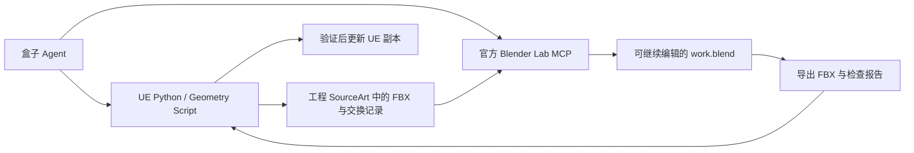

# Blender 与 UE 的 DCC 互联

首版面向建筑构件和道具：把 UE 静态模型送到 Blender 建模，再把结果作为可反复更新的副本带回同一个 UE 工程。UE 原件、场景摆放和原有材质有明确的保留规则。

## 使用方式

在盒子偏好设置的 MCP 页连接官方 Blender Lab 服务，随后让 Agent 使用 `blender-ue-pipeline` 技能。例如：

> 把当前道具送到 Blender，四周做 4 厘米倒角，再回传 UE。保留原件和尺寸，创建一个 `_DCC` 副本。

第一次回传创建副本。用户把副本放进关卡之后，继续说“把倒角调细一点，再更新刚才的副本”，管道会更新同一个资产。引用该副本的场景实例保留位置、旋转和缩放。原件的场景实例不会被自动替换。

技能与执行脚本：[blender-ue-pipeline](../resources/skills/blender-ue-pipeline/SKILL.md)。安装方法：[官方 MCP 设置](../resources/skills/blender-ue-pipeline/references/setup.md)。

Blender 没开着不需要用户处理。调用需要桥的工具而端口连不上时，盒子按 MCP 配置里的 `BLENDER_PATH` 自己启动 Blender（带 `--online-mode`，插件的 Auto Start 会接管开桥），等桥通了把这次调用重跑一遍，并在结果里说明自动启动过。只有连接被拒会触发，超时不会 —— 超时表示结果未知。Blender 已经开着但桥没启动时不再开第二个窗口，只报出该在偏好设置里点哪里。启动逻辑在 [blenderBridge.ts](../src/main/agent-v3/capabilities/mcp/blenderBridge.ts)。

官方 server 还有一条不经过桥的后台通道：`execute_blender_code_for_cli` 和 `get_blendfile_summary_*` 由 server 自己起 `blender --background` 执行。纯批处理可以完全不开窗口，代价是没有视口截图、进程之间不留状态。

## 链路有四层，症状只有一句

桥调用要成功，四件事都得成立：`blender-mcp` 进程活着、Blender 开着、官方插件装了且启用、桥在监听。**四层里断哪一层，报错都只有 `Cannot connect to Blender at 127.0.0.1:9876` 这一句**，用户只能拿命令行一层层查。两条对策：

- **设置页的「已连接」只代表第一层** —— 那是与桥进程的 stdio 握手，不代表 Blender 可达。技能要求握手后显式读一次 `bpy.app.version_string` 才算连上。
- **拉不起来时由 Blender 自己回答断在哪** —— 盒子起一个后台 Blender 读三项状态（插件装没装、启用没启用、在线访问开没开），把「该修哪一层」直接写进报错，不猜。

另外两种同样被这一句掩盖的情况，现在也各有各的说法：**端口被别的程序占着**时插件绑不上，再开 Blender 也没用，所以探测不只看端口通不通，还要和对面握一次手（发一个插件不认识的消息类型，它会直接回一个 `status: error` 的 JSON 而不执行任何代码），认出不是桥就直接叫用户换 `BLENDER_MCP_PORT`；**同机装了多个 Blender** 时，判断「目标是不是已经在运行」按完整路径比而不是按文件名比，否则用户开着 4.5 会让盒子拒绝启动配置里的 5.2，还给出一段基于 5.2 的诊断。

两个真机踩到的隐蔽前提：插件的安装步骤以前是 `setup_mcp.ps1` 的可选开关，不加就整个跳过，而服务端、源码、venv 全都齐着，缺口藏在 Blender 的扩展目录里；插件把开桥当联机行为，Blender 的「允许在线访问」默认关着就拒绝监听端口，所以用户自己双击打开的 Blender 基本连不上。现在插件默认装且装完回读，盒子拉 Blender 一律带 `--online-mode`。

## 分工与文件

这里的 DCC 指内容制作工具互联，与 UE 的 Derived Data Cache 缓存无关。首版沿用盒子的 MCP 客户端和 UE Python 通道，不增加 C++ 命令、数据库表或新的主进程接口。

默认交换目录在 `.uproject` 旁的 `SourceArt/UnrealBox/<交换编号>/`。其中 `work.blend` 是建模源文件；`manifest.json` 记录工程、原件、副本、版本和指纹；`source.fbx`、`edited.fbx` 与 `export.json` 用于往返和验收。这些文件需要随工程备份，不能当缓存删除。

Blender 导入时把厘米转换形成的对象缩放应用到新导入的网格，确保 0.04 米倒角确实等于 4 厘米。导出保留 `.blend` 中的修改器。UE 先导入暂存资产，核对三角面、尺寸和每组材质的面数，成功后再更新副本并重新读取。

## 平台边界与验证

Windows 保留 `setup_mcp.ps1` 与 `Win32_Process` 查询。macOS 使用 Python 3.11+ 运行 `setup_mcp.py`，接受 `.app` 或内部可执行文件，将固定版本的官方服务安装到用户 Application Support 下的独立环境，使用 `venv/bin/blender-mcp`，并回读插件安装、启用状态。

Mac 自动启动按真实可执行路径判断进程，避免多版本误认；安装器将 `.app/Contents/MacOS/Blender` 写入配置。安装器和进程识别已有自动化测试，但仍需在装有 Blender 与 UE 的 Mac 上验证真实安装、桥连接和模型往返，不能用模拟命令测试替代实机验收。Linux 安装流程暂未覆盖。

## 首版边界

- 单个静态模型、一个源 LOD；每个材质槽已赋材质且材质名称各不相同。
- 默认保持局部尺寸，允许 1 毫米浮点误差。明确要求改尺寸时才能关闭这项检查，并核对新尺寸。
- UE 材质引用与面分配保留。Blender 材质节点不转换成 UE 材质图。
- 原碰撞保留；形状改变后要单独检查并按需重建碰撞。
- 不自动处理骨骼、动画、毛发、LOD 链、资产拆分合并或全场景同步。
- 接入专业软件不等于自动获得高质量角色雕刻或单张照片精确还原能力。复杂角色仍需要额外的建模、贴图、绑定和质量验收流程。

## 异常处理

工程不符、原件或副本被其他操作修改、导出文件变化、材质不匹配、空模型、尺寸异常时停止回传。后续写入失败会尝试恢复上一版几何；首次写入失败可能留下待检查的副本，不能把它算作完成。

已经成功记录的同一份导出重复回传不会新建资产或增加版本。超时表示结果未知，要先检查资产和交换记录；不能直接当作取消并重复执行。

官方 MCP 的执行工具可能在协议成功响应内返回 `status: error`，技能要求同时核对这两层结果。连接通过本地回环地址；安装阶段明确下载官方固定版本，日常建模不自动联网安装或更新。

## 建模质量：借鉴 img2threejs

往返成功只证明资产可以传输。现在加入 img2threejs 的参考分析、分阶段建模和逐项复核方法，适配 Blender 的原生网格、曲线、修改器与雕刻工作流。

先记录参考图里实际看得见的比例、轮廓、部件、孔洞、接触关系及关键细节，把隐藏部分的推测单独标明。按大形 → 结构 → 细节 → 表面表现的顺序制作和复核。连续曲面采用连续表面建模，把手、管线采用曲线或扫掠，避免所有对象都退化为基本体拼接。

每项建模编辑在交换目录中保留 `quality-plan.json`，列出真实验收特征、各自的制作方法、相机视角和面数预算。导出增加拓扑计数与源文件指纹；独立 Blender 进程生成五方向灰模视图，记录到 `quality-captures.json`。Agent 看过图后，逐项写入 `quality-review.json`。回传会检查关键特征、拓扑、UV、预算以及文件是否属于同一版；改了模型或计划，旧验收就失效。

规则与例子：[建模质量流程](../resources/skills/blender-ue-pipeline/references/modeling-quality.md)。这套检查不能自动证明没有自交，也不会自动打“还原度 95%”之类的分数。五向灰模不能代替照片相机匹配、局部细节检查或 UE 材质验收；复杂角色仍不在首版静态道具管道范围内。

## 本机验收（2026-09-06）

Blender 5.2.1 LTS、UE 5.5.4；独立测试工程，不修改用户正式工程。

- 120 × 80 × 200 厘米测试道具，48 面原件 → 192 面第一版 → 432 面第二版。
- 两个不同位置、旋转、非等比缩放的关卡实例，在第二轮回传后保持引用和变换；新启动 UE 再读仍正确。
- 两组 UE 材质及 216 / 216 面分配、两套 UV 保留；原件仍为 48 面。
- 错工程、目标冲突、放大 100 倍均被拦截，原件、副本文件和版本记录未变。
- 应用导入缩放后制作了实际 4 厘米倒角样例，432 面回传与 UE 渲染网格一致。
- 实际盒子 MCP 客户端读取了已安装的官方服务，发现 26 个工具，并通过它执行了 Blender 建模与导出。

本机逐项证据及打开方式见工作目录下 `.tmp/blender-dcc-acceptance/acceptance.md`。本段仅记录上述实测范围，不代表完整角色生产流程已经实现。
